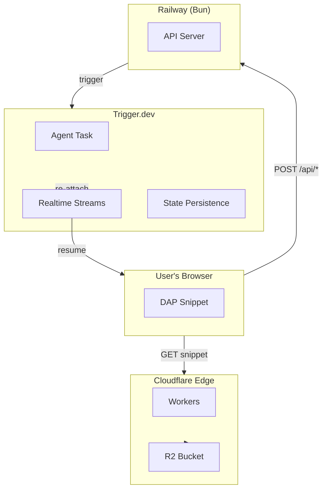

# Project Rafael: A Blueprint for Addressing Software Friction

**Author**: Rafael Protocol Team

**Date**: February 2026

**Status**: Architectural Proposal & Concept Paper

**Stack**: Kimi · Gemini · Claude · Trigger.dev · Cloudflare Workers · Bun · TypeScript

---

## 1. Abstract

As software complexity scales, the gap between what a user intends to do and their ability to navigate the interface—what I call **Interface Friction**—continues to widen. For years, Digital Adoption Platforms (DAPs) have tried to solve this with static tooltips. However, these systems often struggle with "brittle" selectors that break when a UI updates.

This paper outlines Rafael, a conceptual open-source protocol. The goal is to explore shifting from passive guidance to **supported execution**. By combining a Triad Intelligence of AI models with a durable execution backend, Rafael aims to create a layer that helps complete tasks rather than just explaining them.

---

## 2. The Observations: The Brittle Selector Problem

In my experience with technical documentation, I've seen how quickly "how-to" guides become obsolete. Current DAPs often face the same issue: they rely on hard-coded CSS paths. When an enterprise application like Salesforce or Workday makes even a minor update, these anchors snap, rendering the entire onboarding library useless.

Beyond maintenance, there is the issue of effort. Most DAPs are **passive**, requiring the user to read a prompt and then perform the action themselves. I am exploring whether we can use AI to reason through the Document Object Model (DOM) via a **SemanticTree**—a compressed, privacy-first representation of the UI—to reduce the cognitive load on the user.

---

## 3. The Proposed Logic: Multi-Model Routing (Triad Intelligence)

To ensure stability and speed, I am proposing an architecture that doesn't rely on a single AI provider. I call this **Model Heterogeneity**, using different "specialists" for different needs to optimize for both reasoning depth and cost:

| Model      | Role               | Purpose                                                          |
| ---------- | ------------------ | ---------------------------------------------------------------- |
| **Claude** | Lead Engineer      | High-stakes DOM reasoning and complex multi-step tool use        |
| **Gemini** | Vision Specialist  | Fast, sub-second snapshots and triage of current UI state        |
| **Kimi**   | Context Specialist | Process large-scale enterprise documentation and knowledge bases |

By routing these through a gateway like **Cloudflare AI Gateway**, the system aims to achieve higher uptime and lower latency than a single-model approach.

---

## 4. Proposed Infrastructure: Ensuring Task Durability

One of the most difficult parts of browser automation is losing progress when a tab is closed or a connection drops. My proposal suggests using **Durable Execution** (specifically the logic used in Trigger.dev v3) to solve this:



### Key Components

- **Background Tasks**: Moving the "brain" of the operation to a backend server (hosted on Railway using Bun for ultra-fast execution).
- **State Persistence**: Ensuring the task stays "alive" in the cloud even if the user refreshes the browser or switches devices.
- **Real-time Re-attachment**: Utilizing Trigger.dev Realtime Streams to allow the agent to re-attach to the live DOM once the user returns to the page.
- **Edge Delivery**: Utilizing Cloudflare Workers to deliver the lightweight snippet and manage session routing with sub-50ms global latency.

---

## 5. Potential Economic Shift

If this logic holds, the value proposition of digital adoption changes fundamentally:

| Legacy DAP                                                           | Rafael Protocol                                         |
| -------------------------------------------------------------------- | ------------------------------------------------------- |
| Organizations pay for a tool that teaches a user how to use software | Organizations pay for the completion of the task itself |
| Training cost                                                        | Operational saving                                      |
| Passive guidance                                                     | **Active execution**                                    |

This turns the DAP into a **"Labor-as-a-Service"** center.

---

## 6. Conclusion & Open Invitation

I am a technical writer, not a traditional software engineer. I am approaching this as an architect of information, using my background to define the logic of how we turn "Knowledge Bases" into "Action Bases." I am using modern AI tools and a robust stack—Bun, TypeScript, and Trigger.dev—to help bridge the coding gap and build the foundation.

I'm sharing the Rafael Protocol as an **open-source blueprint** because I believe the best solutions for software friction should be transparent and collaborative. This is an experiment in its early stages. If you are an engineer or a fellow writer interested in how we might move from "static docs" to "active agents," I invite you to look at the logic and join the conversation on GitHub.

---

## 📁 Project Structure

```
rafael-protocol/
├── .github/workflows/     # CI/CD pipeline
├── .env.example          # Environment template
├── apps/server/          # Railway API server
├── docs/                 # Documentation
├── packages/types/       # Shared TypeScript types
├── .gitignore
├── package.json         # Monorepo root
├── tsconfig.json
└── README.md
```

---

## 🛠️ Tech Stack

- **AI Models**: Claude, Gemini, Kimi
- **Runtime**: Bun
- **Language**: TypeScript
- **Task Execution**: Trigger.dev
- **Edge**: Cloudflare Workers + R2
- **Backend**: Railway

---

<p align="center">
  <strong>From Knowledge Bases to Action Bases</strong>
</p>
