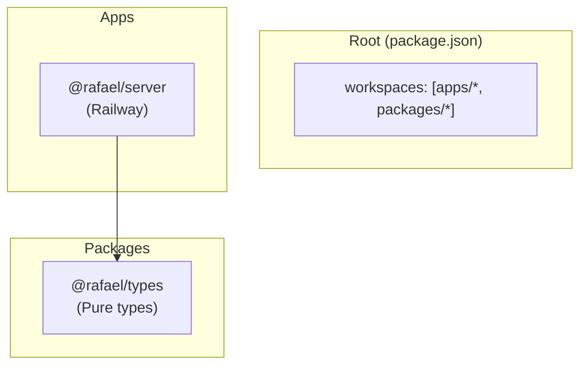
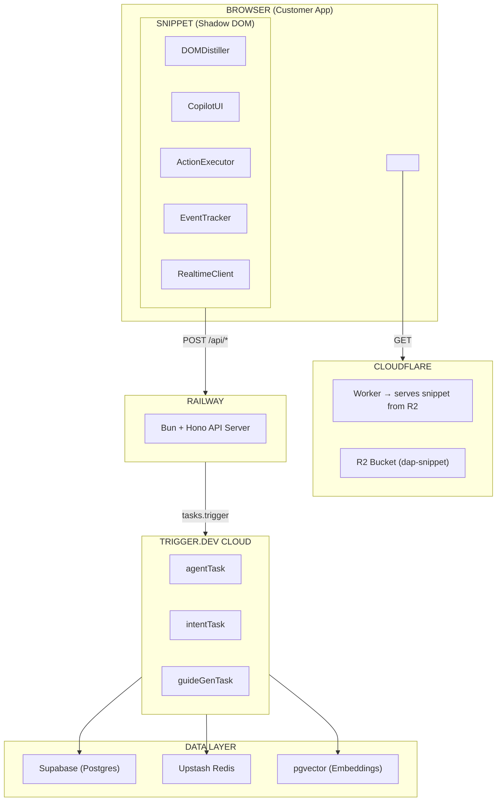

# 🚀 Rafael Protocol

<p align="center">
  
  
  
</p>

<p align="center">
  <strong>AI-Native Digital Adoption Platform</strong> — Built with Claude Agents · TypeScript · Bun · Trigger.dev · Railway · Cloudflare
</p>

---

## 📋 Table of Contents

- [Overview](#overview)
- [Project Structure](#project-structure)
- [Architecture](#architecture)
- [Tech Stack](#tech-stack)
- [Getting Started](#getting-started)
- [Documentation](#documentation)
- [Contributing](#contributing)
- [License](#license)

---

## 🎯 Overview

Rafael Protocol is a **next-generation Digital Adoption Platform (DAP)** built from first principles in 2026. It disrupts traditional solutions like WalkMe by leveraging AI to deliver:

| Traditional DAP            | Rafael Protocol                           |
| -------------------------- | ----------------------------------------- |
| Manual, weeks of authoring | Auto-generated from session data          |
| Constant manual updates    | Self-healing, auto-detects UI changes     |
| Passive tooltips           | **Active execution** — AI does it for you |
| Role-based segments        | Individual + contextual personalization   |
| No intelligence            | Learns from every session                 |
| $100k–$500k/yr             | Disruptive wedge pricing                  |

---

## 📁 Project Structure

```
rafael-protocol/
├── .github/
│   └── workflows/
│       └── deploy.yml          # CI/CD pipeline
├── .env.example                # Environment variables template
├── apps/
│   └── server/                 # Railway API server (Bun + Hono)
│       ├── src/
│       │   └── index.ts
│       └── package.json
├── docs/
│   └── architecture.md         # Full architecture document
├── packages/
│   └── types/                  # Shared TypeScript types
│       ├── src/
│       │   └── index.ts
│       └── package.json
├── .gitignore
├── package.json               # Monorepo root
├── tsconfig.json              # TypeScript config
└── README.md
```

### Package Dependency Graph



---

## 🏗️ Architecture



---

## 🛠️ Tech Stack

| Component        | Technology              | Purpose                       |
| ---------------- | ----------------------- | ----------------------------- |
| 🤖 **AI Agent**  | Claude (Anthropic)      | Reasoning & tool execution    |
| ⚡ **Runtime**   | Bun                     | Fast JavaScript runtime       |
| 🖥️ **Backend**   | Hono + Railway          | Always-on API server          |
| ⏱️ **Tasks**     | Trigger.dev             | Durable task execution        |
| 🌐 **CDN**       | Cloudflare R2 + Workers | Global snippet delivery       |
| 💾 **Database**  | Supabase                | Users, orgs, sessions, guides |
| 🧠 **Vector DB** | pgvector                | Knowledge graph embeddings    |
| ⚡ **Cache**     | Upstash Redis           | Context caching               |

---

## 🚦 Getting Started

### Prerequisites

- [Bun](https://bun.sh/) 1.0+ or Node.js 18+
- Git
- GitHub account

### Quick Start

```bash
# Clone the repository
git clone https://github.com/cyalcala/rafael-protocol.git

# Navigate to project
cd rafael-protocol

# Install dependencies
bun install

# Run development server
bun run dev

# Type check
bun run typecheck
```

### Environment Setup

```bash
# Copy environment template
cp .env.example .env

# Configure your environment variables
# See .env.example for required variables
```

---

## 📚 Documentation

| File                                              | Description                     |
| ------------------------------------------------- | ------------------------------- |
| 📄 [docs/architecture.md](./docs/architecture.md) | Master Architecture Document    |
| 📄 [.env.example](./.env.example)                 | Environment variables reference |

---

## 🤝 Contributing

1. Fork the repository
2. Create your feature branch (`git checkout -b feature/amazing-feature`)
3. Commit your changes (`git commit -m 'Add amazing feature'`)
4. Push to the branch (`git push origin feature/amazing-feature`)
5. Open a Pull Request

---

## 📄 License

This project is licensed under the MIT License.

---

## 🙏 Acknowledgments

- Built with 🤖 by Claude
- Architecture validated by Claude and Gemini AI systems

---

<p align="center">
  <strong>The window is open. The models are ready. The market is waiting.</strong>
</p>

---

<p align="center">
  <em> Rafael Protocol</em>
</p>
