# 🚀 Rafael Protocol

<p align="center">
  
  
  
</p>

<p align="center">
  <strong>AI-Native Digital Adoption Platform</strong> — Built with Claude Agents · TypeScript · Bun · Trigger.dev · Railway · Cloudflare
</p>

---

## 📋 Table of Contents

- [Overview](#overview)
- [Architecture](#architecture)
- [Tech Stack](#tech-stack)
- [Key Features](#key-features)
- [System Flow](#system-flow)
- [Data Pipeline](#data-pipeline)
- [Getting Started](#getting-started)
- [Documentation](#documentation)
- [Contributing](#contributing)
- [License](#license)

---

## 🎯 Overview

Rafael Protocol is a **next-generation Digital Adoption Platform (DAP)** built from first principles in 2026. It disrupts traditional solutions like WalkMe by leveraging AI to deliver:

| Traditional DAP            | Rafael Protocol                           |
| -------------------------- | ----------------------------------------- |
| Manual, weeks of authoring | Auto-generated from session data          |
| Constant manual updates    | Self-healing, auto-detects UI changes     |
| Passive tooltips           | **Active execution** — AI does it for you |
| Role-based segments        | Individual + contextual personalization   |
| No intelligence            | Learns from every session                 |
| $100k–$500k/yr             | Disruptive wedge pricing                  |

---

## 🏗️ Architecture

```mermaid
flowchart TB
    subgraph Browser["BROWSER (Customer App)"]
        direction TB
        Script["<script src='cdn.rafael.io/dap.min.js' data-app-key='rafael_xxx'></script>"]

        subgraph Snippet["SNIPPET (Shadow DOM)"]
            DOMDistiller["DOMDistiller"]
            CopilotUI["CopilotUI"]
            ActionExecutor["ActionExecutor"]
            EventTracker["EventTracker"]
            RealtimeClient["RealtimeClient"]
        end

        DOMDistiller -->|SemanticTree| CopilotUI
        ActionExecutor -->|executes| DOMDistiller
        EventTracker -->|sends events| RealtimeClient
    end

    subgraph Cloud["CLOUDFLARE"]
        Worker["Worker → serves snippet from R2"]
        R2["R2 Bucket (dap-snippet)"]
    end

    subgraph Railway["RAILWAY"]
        API["Bun + Hono API Server"]
        AgentEndpoint["/api/agent"]
        EventsEndpoint["/api/events"]
        GuidesEndpoint["/api/guides"]
    end

    subgraph Trigger["TRIGGER.DEV CLOUD"]
        AgentTask["agentTask"]
        IntentTask["intentTask"]
        GuideGenTask["guideGenTask"]
        AuditTask["auditTask"]
        EventIngestTask["eventIngestTask"]
    end

    subgraph Data["DATA LAYER"]
        Supabase["Supabase (Postgres)"]
        Redis["Upstash Redis"]
        pgvector["pgvector (Embeddings)"]
    end

    Script -->|GET dap.min.js| Cloud
    Cloud --> R2

    Snippet -->|POST /api/agent| Railway
    Snippet -->|POST /api/events| Railway
    Snippet -->|SSE subscribe| Trigger

    Railway --> AgentEndpoint
    Railway --> EventsEndpoint
    Railway --> GuidesEndpoint

    Railway -->|tasks.trigger| Trigger
    Trigger --> AgentTask
    Trigger --> IntentTask
    Trigger --> GuideGenTask
    Trigger --> AuditTask
    Trigger --> EventIngestTask

    Trigger --> Supabase
    Trigger --> Redis
    Trigger --> pgvector
```



### Hybrid Architecture Model


---

## 🛠️ Tech Stack


| Component        | Technology              | Purpose                       |
| ---------------- | ----------------------- | ----------------------------- |
| 🤖 **AI Agent**  | Claude (Anthropic)      | Reasoning & tool execution    |
| ⚡ **Runtime**   | Bun                     | Fast JavaScript runtime       |
| 🖥️ **Backend**   | Hono + Railway          | Always-on API server          |
| ⏱️ **Tasks**     | Trigger.dev             | Durable task execution        |
| 🌐 **CDN**       | Cloudflare R2 + Workers | Global snippet delivery       |
| 💾 **Database**  | Supabase                | Users, orgs, sessions, guides |
| 🧠 **Vector DB** | pgvector                | Knowledge graph embeddings    |
| ⚡ **Cache**     | Upstash Redis           | Context caching               |

---

## ✨ Key Features

### Core Capabilities


1. **🤖 Auto-Generated Guides** — No manual authoring needed. AI generates guides from session clusters
2. **🔧 Self-Healing** — Automatically detects UI changes and updates guides
3. **⚡ Active Execution** — AI performs tasks for users, not just shows tooltips
4. **👤 Personalization** — Individual + contextual learning for each user
5. **🧠 Knowledge Graph** — Builds understanding from every session
6. **📡 Real-time Streaming** — Live agent thought process via SSE

### The Intelligence Pipeline


---

## 🔄 System Flow

### Full Agent Invocation Flow


### Event Ingestion Flow


---

## 📊 Data Pipeline

### Knowledge Graph Formation


---

## 🚦 Getting Started

### Prerequisites

- Node.js 18+ or Bun 1.0+
- Git
- GitHub account

### Quick Start

```bash
# Clone the repository
git clone https://github.com/cyalcala/rafael-protocol.git

# Navigate to project
cd rafael-protocol

# View the architecture document
cat dap-agent.md

# Check out the initial commit
cat INITIAL.md
```

### Environment Variables

See `dap-agent.md` section 15 for the complete environment variables reference.

```bash
# Required environment variables
ANTHROPIC_API_KEY=sk-ant-...
TRIGGER_SECRET_KEY=tr_prod_...
DATABASE_URL=postgresql://...
```

---

## 📚 Documentation

| File                              | Description                                                     |
| --------------------------------- | --------------------------------------------------------------- |
| 📄 [dap-agent.md](./dap-agent.md) | Master Architecture Document - Complete technical specification |
| 📄 [INITIAL.md](./INITIAL.md)     | Initial commit documentation                                    |
| 📄 [README.md](./README.md)       | This file - Project overview with diagrams                      |

---

## 🤝 Contributing

1. Fork the repository
2. Create your feature branch (`git checkout -b feature/amazing-feature`)
3. Commit your changes (`git commit -m 'Add amazing feature'`)
4. Push to the branch (`git push origin feature/amazing-feature`)
5. Open a Pull Request

---

## 📄 License

This project is licensed under the MIT License - see the [LICENSE](LICENSE) file for details.

---

## 🙏 Acknowledgments

- Built with 🤖 by Claude
- Inspired by [WalkMe](https://www.walkme.com/) - the category leader we're disrupting
- Architecture validated by both Claude and Gemini AI systems

---

<p align="center">
  <strong>The window is open. The models are ready. The market is waiting.</strong>
</p>

---

<p align="center">
  <em>Document compiled: February 2026</em>
</p>
